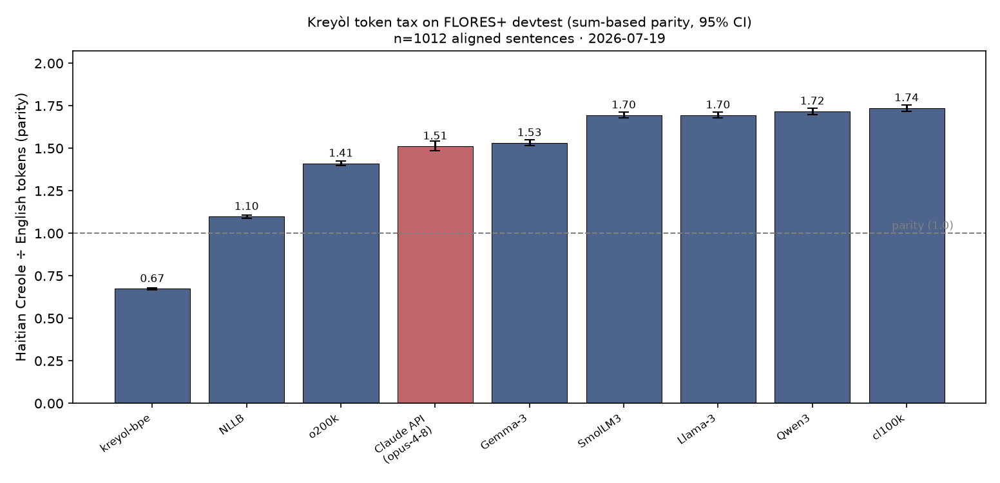

# Tokenizer fertility for Haitian Creole — Workstream C

*Measurement snapshot: 2026-07-19. Generated by `ml/fertility/` — see [../../docs/phase-0.md](../../docs/phase-0.md) (Workstream C) and [../../docs/plan.md](../../docs/plan.md) §3.3.*

## Headline

On 1012 aligned FLORES+ `devtest` sentences, the same content costs **1.74× more tokens in Haitian Creole than in English** on `cl100k` and as little as **0.67×** on `kreyol-bpe`. Full parity table below, with paired-bootstrap 95% CIs.

**Our Kreyòl tokenizer (`kreyol-bpe`, Workstream B) lands at ht/en parity 0.67× (95% CI [0.67, 0.68]) and ht/fr 0.57× ([0.56, 0.57]).** It **flips the tax**: identical content now costs *fewer* tokens in Kreyòl than in English — the point of training a Kreyòl-first vocabulary.

**This extends Petrov et al. (2023)** ([arXiv:2305.15425](https://arxiv.org/abs/2305.15425)), who measured Haitian Creole through the cl100k-era tokenizers — our cl100k and NLLB rows reproduce theirs. The new contribution is the post-2023 generation: **as of 2026-07-19 we could find no previously published Haitian-Creole parity numbers for o200k, Gemma-3, Qwen3, SmolLM3, Llama-3, or any Claude API estimate** — those rows are, to our knowledge, first published here, alongside our own Kreyòl tokenizer. ("First published we could find," not "first-ever.")

## Pipeline validation (Petrov et al. 2023)

Before measuring anything new, we reproduce Petrov et al.'s published Haitian/English `cl100k_base` parity from **their** released data with **our** counting code ([tokenization-fairness](https://github.com/aleksandarpetrov/tokenization-fairness), pinned commit `365c3f85bdb3`).

| Source | ht tokens | en tokens | ht/en parity |
|---|--:|--:|--:|
| Petrov released totals (`tokenization_lengths.csv`) | 91870 | 52835 | **1.7388** |
| Our cl100k recount of his devtest sentences | 47250 | 27182 | **1.7383** |

*his totals span dev+devtest (2009 sents); our recompute is devtest-only (1012) — parity is scale-invariant, so ratios match.* Our recomputed parity **1.7383** lands within ±0.03 of his **1.739**, so the counting pipeline is validated; the FLORES+ numbers below are then our own measurement (expected close to his FLORES-200 figure, not gated to match).

## Methodology

- **Corpus.** `openlanguagedata/flores_plus` split `devtest`, pinned revision `b3a5298db5721c8a682e7ef00a37fcc9ab522757`. Languages `hat_Latn`/`eng_Latn`/`fra_Latn`, **joined by (split, id)** → 1012 aligned sentences. FLORES+ is **eval-only by its terms**; no sentence text is committed or re-hosted in this repo (downloads land in git-ignored `ml/data/`).
- **Normalization.** NFC (è/ò consistency). No lowercasing, no accent stripping.
- **Token counting.** Content tokens only: HF tokenizers use `encode(text, add_special_tokens=False)`; tiktoken adds no special tokens; so no language gets a constant per-sentence special-token surcharge that would dilute parity.
- **Word segmentation (for tokens/word).** A word is a maximal run of Unicode letters, allowing an internal apostrophe or hyphen joining two letter-runs. **Apostrophe-clitic forms like `m'ap`, `l'ap`, `n'ap` and hyphen compounds like `pitit-pitit` count as a single word** (we do not split on internal `'`/`-`). Digits/punctuation are not words. Word totals on this set: ht=22867, en=21684, fr=25050.
- **Primary parity.** `sum(ht tokens) / sum(en tokens)` over the whole corpus (and vs French) — **not** the mean of per-sentence ratios. Uncertainty: paired bootstrap (resample sentence indices, 2000 reps, seed 20260719), 95% percentile CI. We also report p10/p50/p90 of the per-sentence ratio.
- **Whole-word survival.** For the core Kreyòl list (`te`, `ta`, `ap`, `pral`, `va`, `mwen`, `m`, `ou`, `w`, `li`, `l`, `nou`, `n`, `yo`, `y`, `pa`, `la`, `a`, `an`, `lan`, `nan`, `sa`, `ki`, `gen`, `fè`), each checked **bare and with a leading space**; single-token = survives. Reported as fraction of 50 checks.
- **Sentences per 8k budget.** 8192 ÷ mean tokens/sentence (order-independent).
- **Claude.** Separately-labeled API measurement, **not** a tokenizer count. `client.messages.count_tokens(model="claude-opus-4-8")`, ~200 sentences/message joined by newline; the minimal-message overhead is measured and subtracted per batch; exponential backoff on 429. Because it is batched, per-sentence quantiles and survival are N/A and its CI is a coarse **batch-level** bootstrap.
  - The endpoint is an *estimate* and here reports markedly more tokens than the subword tokenizers (≈2.0 tokens/English-word vs ≈1.26 for cl100k), so Claude's **absolute** counts and tokens/word are **not** directly comparable to the tokenizer rows — only its within-API **parity** ratio (ht÷en, ht÷fr) is comparable. A 100-sentence cross-check found batched vs per-sentence parity agree to ~0.02 (1.468 vs 1.488), so the newline-batching does not distort the reported parity.

## Tokenizers measured (pinned revisions)

| Label | repo / encoding | revision |
|---|---|---|
| cl100k (GPT-4 / GPT-3.5-era) | `tiktoken:cl100k_base` | `tiktoken==0.13.0` |
| o200k (GPT-4o-era) | `tiktoken:o200k_base` | `tiktoken==0.13.0` |
| Gemma-3 (google/gemma-3-4b-pt) | `google/gemma-3-4b-pt` | `cc012e0a6d0787b4adcc0fa2c4da74402494554d` |
| Qwen3 (Qwen/Qwen3-1.7B) | `Qwen/Qwen3-1.7B` | `70d244cc86ccca08cf5af4e1e306ecf908b1ad5e` |
| NLLB (facebook/nllb-200-distilled-600M) | `facebook/nllb-200-distilled-600M` | `f8d333a098d19b4fd9a8b18f94170487ad3f821d` |
| SmolLM3 (HuggingFaceTB/SmolLM3-3B) | `HuggingFaceTB/SmolLM3-3B` | `a07cc9a04f16550a088caea529712d1d335b0ac1` |
| Llama-3 (meta-llama/Llama-3.1-8B) | `meta-llama/Llama-3.1-8B` | `d04e592bb4f6aa9cfee91e2e20afa771667e1d4b` |
| kreyol-bpe (ours, Workstream B) | `tokenizer/kreyol-bpe/tokenizer.json` | `local` |
| claude_api_input_parity (claude-opus-4-8) | `claude-opus-4-8` | `claude-opus-4-8` |

> **Note:** SmolLM3's tokenizer **is** the Llama-3 tokenizer — verified 2026-07-21: identical vocab (128,256) and identical encodings on a 205-text probe (accents, clitics, numbers, code-switch). The SmolLM3 and Llama-3 rows are the same tokenizer measured twice; their digit-identical parity confirms it empirically.

## Results — parity (Haitian Creole ÷ English)



| Tokenizer / API | ht/en parity | 95% CI | % premium | ht/fr parity | ht tok/word | word survival | sents/8k (ht vs en) |
|---|--:|:--:|--:|--:|--:|--:|:--:|
| kreyol-bpe (ours, Workstream B) | **0.674** | [0.668, 0.681] | -32.6% | 0.567 | 1.286 | 50/50 | 281.9 vs 190.1 |
| NLLB (facebook/nllb-200-distilled-600M) | **1.099** | [1.089, 1.108] | +9.9% | 0.813 | 1.472 | 50/50 | 246.3 vs 270.6 |
| o200k (GPT-4o-era) | **1.411** | [1.398, 1.425] | +41.1% | 1.032 | 1.659 | 47/50 | 218.6 vs 308.5 |
| claude_api_input_parity (claude-opus-4-8) | **1.513** | [1.485, 1.541] | +51.3% | 1.022 | 2.839 | — | 127.7 vs 193.2 |
| Gemma-3 (google/gemma-3-4b-pt) | **1.532** | [1.517, 1.549] | +53.2% | 1.088 | 1.817 | 47/50 | 199.5 vs 305.8 |
| SmolLM3 (HuggingFaceTB/SmolLM3-3B) | **1.695** | [1.678, 1.713] | +69.5% | 1.060 | 2.014 | 44/50 | 180.0 vs 305.1 |
| Llama-3 (meta-llama/Llama-3.1-8B) | **1.695** | [1.678, 1.713] | +69.5% | 1.060 | 2.014 | 44/50 | 180.0 vs 305.1 |
| Qwen3 (Qwen/Qwen3-1.7B) | **1.718** | [1.699, 1.737] | +71.8% | 1.087 | 2.075 | 43/50 | 174.7 vs 300.1 |
| cl100k (GPT-4 / GPT-3.5-era) | **1.737** | [1.718, 1.756] | +73.7% | 1.082 | 2.065 | 43/50 | 175.6 vs 305.0 |

> The `claude_api_input_parity` row is an API measurement, not a tokenizer: compare its **parity** (and % premium) across rows, but not its absolute `tok/word` — the `count_tokens` estimate runs coarser than the subword tokenizers (see Methodology).

Per-sentence ratio spread (ht/en):

| Tokenizer / API | p10 | p50 | p90 |
|---|--:|--:|--:|
| kreyol-bpe (ours, Workstream B) | 0.5476 | 0.6735 | 0.8285 |
| NLLB (facebook/nllb-200-distilled-600M) | 0.9167 | 1.1053 | 1.3158 |
| o200k (GPT-4o-era) | 1.1504 | 1.4065 | 1.7368 |
| claude_api_input_parity (claude-opus-4-8) | — | — | — |
| Gemma-3 (google/gemma-3-4b-pt) | 1.2273 | 1.5263 | 1.9091 |
| SmolLM3 (HuggingFaceTB/SmolLM3-3B) | 1.3659 | 1.6765 | 2.1 |
| Llama-3 (meta-llama/Llama-3.1-8B) | 1.3659 | 1.6765 | 2.1 |
| Qwen3 (Qwen/Qwen3-1.7B) | 1.3639 | 1.7 | 2.1562 |
| cl100k (GPT-4 / GPT-3.5-era) | 1.3871 | 1.7143 | 2.1761 |

## Illustrative cost premium (priced APIs only)

Shown **only** for tokenizers/APIs tied to an actually-priced API. Prices are an **operator-supplied snapshot dated 2026-07-19 and are ILLUSTRATIVE — verify against each provider's pricing page before quoting; prices drift.** The % premium above is exact and needs no price.

| API | $/M input tokens (snapshot) | source | extra $ for the ht side of this 1012-sentence set |
|---|--:|---|--:|
| cl100k (GPT-4 / GPT-3.5-era) | $10.00 | openai.com/api/pricing — gpt-4-turbo input; ILLUSTRATIVE, VERIFY | $0.2004 |
| o200k (GPT-4o-era) | $2.50 | openai.com/api/pricing — gpt-4o input; ILLUSTRATIVE, VERIFY | $0.0276 |
| claude_api_input_parity (claude-opus-4-8) | $15.00 | anthropic.com/pricing — Opus input; ILLUSTRATIVE, VERIFY | $0.3301 |

## Skipped items & flags

- None — every planned tokenizer and the Claude API measurement completed.
- **No authored-Kreyòl set measured yet.** The translated-vs-authored fertility check (FLORES's Haitian side is itself translated) needs an authored corpus of real size; the only authored set in the repo so far is the 15 probe proverbs (too small to measure alone). **TODO:** assemble a fuller authored-Kreyòl set and re-run for the translationese comparison.

## Reproduce

```bash
cd ml
uv sync
# HF_TOKEN + ANTHROPIC_API_KEY loaded from repo-root .env
uv run python -m fertility.run
```

Outputs: `ml/fertility/results.csv`, `ml/reports/fertility_parity.png`, this file. Bootstrap seed `20260719` fixes the CIs.
